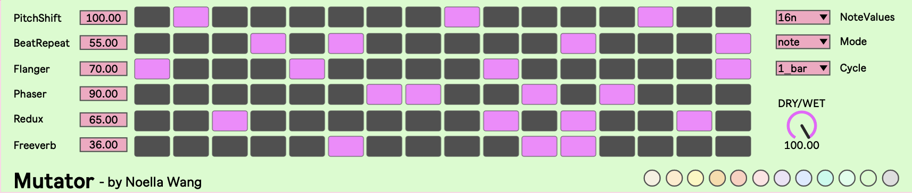
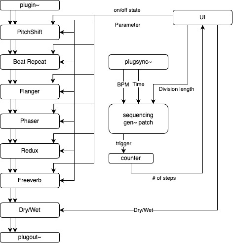

# Mutator

**Mutator** is a multi-sequencing effector **Max for Live** device developed in Max/MSP.

* A block diagram of the device is shown below:

* The effects and sequencer are implemented in the **gen~** environment.

## Table of Contents

* [Features](#features)
* [Minimum Requirements](#minimum-requirements)
* [Usage](#usage)
* [References](#references)
* [Contact](#contact)

## Features

* 6 built-in effects in sequential order:
  * Pitch Shifter
  * Beat Repeat
  * Flanger
  * Phaser
  * Downsampler
  * Schroeder Reverb
* Sequencer to control effect on/off states
  * Numbers of steps is responsive to the Ableton Live project's time signature
  * Adjustable step length (1/4, 1/8, 1/16) with dotted and triplet options
  * Adjustable cycle length (1 bar or 2 bars)
  * The sequencer resets to step 1 at each cycle boundary when using dotted or triplet step lengths, rather than continuing from the fractional step position
* 1 adjustable parameter per effect, rescaled to `0 ~ 100`:
  * Pitch Shifter: shift amount (in semitones, always integers)
  * Beat Repeat: repeat interval (from `1/16` to `1/96`)
  * Flanger: feedback amount and delay time
  * Phaser: modulation amount and modulation speed
  * Downsampler: downsample factor (`0 ~ 1`)
  * Schroeder Reverb: diffusion amount, decay time, and feedback amount
* Global mix control to blend dry and wet signals
* Color palette for UI appearance
  * When the device is first loaded, a random color is chosen from the 12 preset colors
  * Click one of the color swatches to change the color palette

## Minimum Requirements

* Ableton Live 12 Suite or Standard with Max for Live add-on installed.

## Usage

* Load the `Mutator.amxd` file into an Ableton Live MIDI or Audio track.
* Adjust the effect parameters and sequencer settings to your liking.
* Play audio through the track to hear the effects in action.

## References

* Moorer, J.A. (1979). About This Reverberation Business. Computer Music Journal, 3(2), 13–28. https://doi.org/10.2307/3680280
* Reiss, J.D., & McPherson, A. (2014). Audio Effects: Theory, Implementation and Application (1st ed.). CRC Press. https://doi.org/10.1201/b17593
* Schroeder, M.R. (1962). Natural Sounding Artificial Reverberation. Journal of The Audio Engineering Society, 10, 219-223.

## Contact

© 2025 Noella Wang

[Drop a line](https://nonocut.com/contact/)
